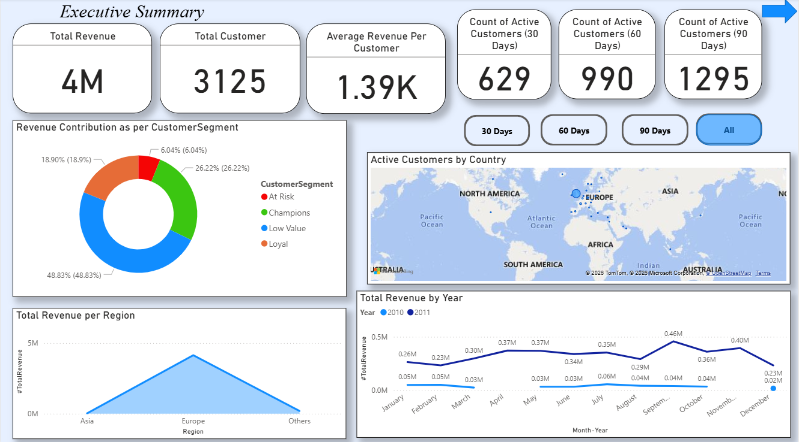
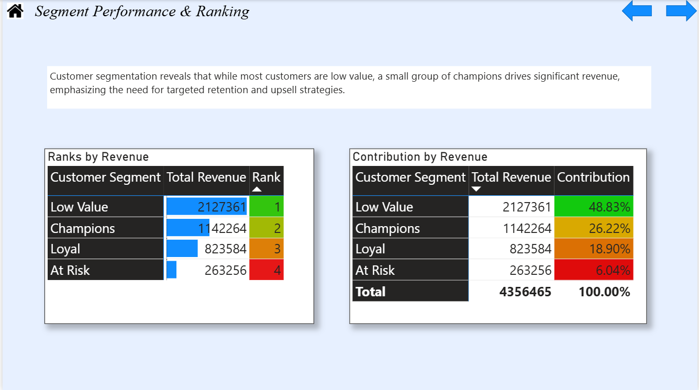

# 📊 Customer Analytics & Revenue Insights Dashboard (Power BI)

This project is an end-to-end Business Intelligence dashboard built using **Microsoft Power BI**.  
It analyzes customer behavior, revenue performance, segmentation, and time-based trends to support data-driven business decisions.

---

## 🚀 Project Objectives

- Analyze overall revenue and customer performance  
- Identify high-value, loyal, and at-risk customers using RFM segmentation  
- Monitor customer retention and declining activity  
- Compare yearly revenue trends  
- Perform time intelligence analysis (MTD, QTD, YTD)  
- Provide actionable business insights through interactive dashboards  

---

## 🛠 Tools & Technologies

- Microsoft Power BI  
- DAX (Data Analysis Expressions)  
- Power Query (ETL)  
- Data Modeling  
- Excel 

---

## 📈 Key Features

### 1️⃣ Executive Summary

- Total Revenue, Total Customers, Average Revenue per Customer  
- Active Customers (Last 30 Days, last 60 days and last 90 days)  
- Revenue by Year and Region  
- Segment-wise Revenue Distribution  

---

### 2️⃣ Customer Overview & Behavior

- Year-over-Year Purchase Comparison  
- Customer Decline Detection  
- Rare-High Revenue Customer Identification  
- Frequency and Revenue Threshold Analysis  

---

### 3️⃣ Customer Segmentation (RFM Analysis)

Classification into:

- Champions  
- Loyal  
- Low Value  
- At Risk  

Features:

- Revenue and Customer Distribution by Segment  
- Business Insights Panel  

---

### 4️⃣ Segment Performance & Ranking

- Revenue Ranking by Segment  
- Contribution Analysis  
- Performance Comparison  

---

### 5️⃣ Time Intelligence & Seasonality

- Month-to-Date (MTD)  
- Quarter-to-Date (QTD)  
- Year-to-Date (YTD)  
- Peak and Lowest Revenue Months  
- Quarterly and Monthly Trend Analysis  
- Dual-Axis Revenue & Frequency Analysis  

---

## 📊 DAX Measures Used

Some key calculations implemented:

- Total Revenue  
- MTD, QTD, YTD  
- Customer Frequency  
- RFM Scores  
- Decline Flag Logic  
- Segment Contribution %  

---

## 📷 Dashboard Preview

### Executive Summary

### Customer Overview & Behavior

### Customer Segmentation (RFM)

### Segment Performance & Ranking

### Time Intelligence & Seasonality

